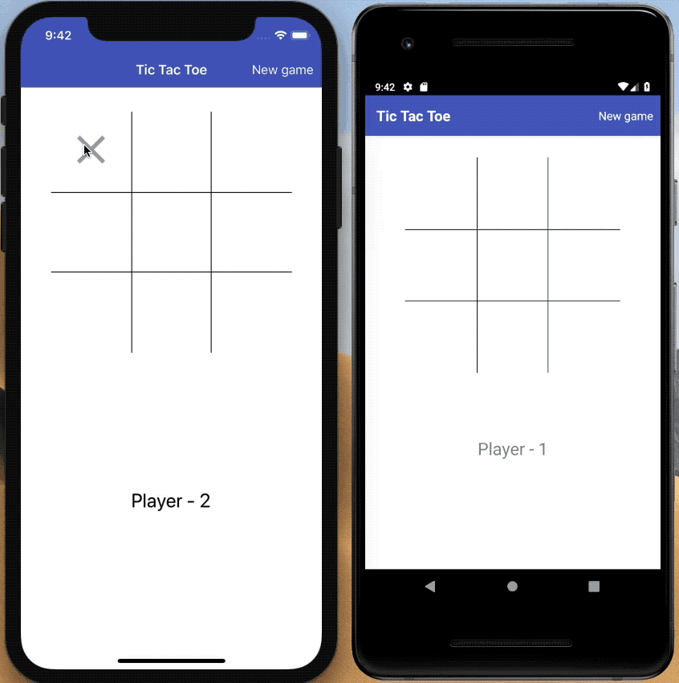

# React Native Tic Tac Toe

This is the source for the Medium.com article on how to migrate a React web-based Tic Tac Toe game to React native.

[Migrating a Web-Based React Tic-Tac-Toe Game to React Native](https://itnext.io/migrating-a-web-based-react-tic-tac-toe-game-to-react-native-ff7cac124f0).

## Setup

Follow the, "Getting Started," guide on the [React Native](https://facebook.github.io/react-native/docs/getting-started) site. Make sure to follow the, "React Native CLI Quickstart," section for your OS and devices you plan on building the app for.

Do not create a new project by running `react-native init`.

- Run `npm install` to restore dependencies for the project.
- To start the app, run:
  - iOS Simulator: `npm run ios`.
  - Android Emulator: `npm run android`.
    - The emulator must be running or a phsyical device must be plugged in before running this command.

## App

